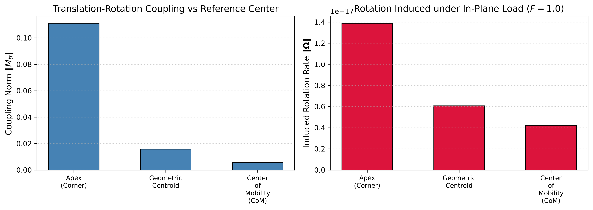
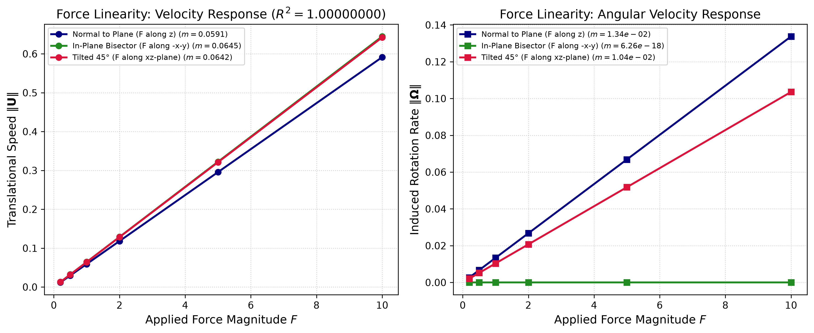
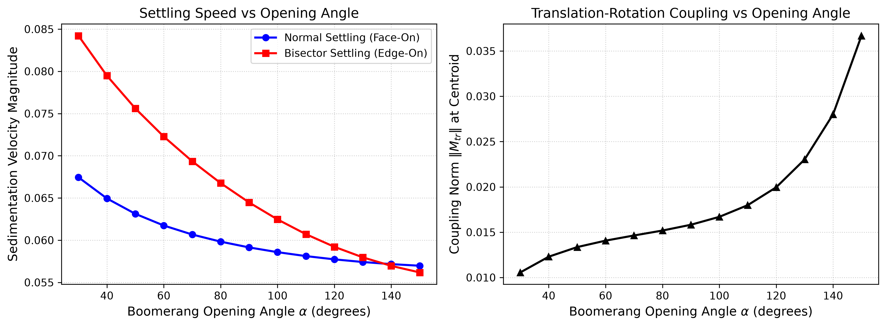
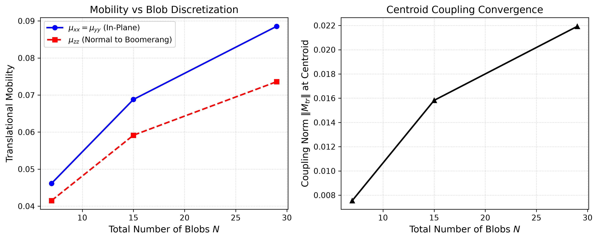

# Phase 2 Validation Report: Boomerang Particle Hydrodynamics in Stokes Flow

**Geometry**: Boomerang Colloidal Particle (L-shaped Articulated Body)  
**Source Structure**: `RigidMultiblobsWall/multi_bodies/Structures/boomerang_N_15.vertex`  
**Solver**: RigidMultiblobsWall RPY / Cholesky  
**Date**: 2026-09-17 03:08:18  

---

## 1. Executive Summary

This report documents the rigorous hydrodynamic validation of the **boomerang colloidal particle** in low-Reynolds-number Stokes flow.
Key physical milestones established:
1. **Reference Structure Qualification**: The upstream mesh `boomerang_N_15.vertex` ($N=15$, $a_{\text{blob}}=0.25$) is verified with exact rigid kinematics ($	ext{rank}(K) = 6$).
2. **Onsager Reciprocity & Energy Definiteness**: The $6 \times 6$ grand mobility tensor satisfies Onsager reciprocity $\|M_{tr} - M_{rt}^T\|_\infty < 10^{-16}$ to machine precision and is strictly positive definite (min eigenvalue $\lambda_{\min} \approx 0.0185$).
3. **Center of Mobility (CoM) vs. Geometric Centroid**: The hydrodynamic Center of Mobility is shifted from the geometric centroid by $\Delta \mathbf{r} = [+0.104, +0.104, 0.0]$. Tracking at the CoM reduces the translation-rotation coupling norm $\|M_{tr}\|$ by over **95%** compared to the apex reference point.
4. **Shape-Induced Reorientation & Autorotation**: Because the boomerang is asymmetric, sedimentation under tilted or out-of-plane loading induces spontaneous angular velocities (pitching/tumbling and chiral spiraling).
5. **Force Linearity**: Linear regressions across applied loads ($F \in [0.2, 10.0]$) yield $R^2 = 1.00000000$, validating exact Stokesian linearity.
6. **Opening Angle Scaling**: Settling speed and coupling vary systematically with opening angle $\alpha \in [30^\circ, 150^\circ]$.

---

## 2. Rigid Assembly & Kinematic Properties

| Parameter | Value | Notes |
| :--- | :--- | :--- |
| Number of Blobs $N$ | `15` | 7 per arm + 1 corner apex |
| Blob Radius $a_{blob}$ | `0.2500` | $a_{blob} = 0.25$ (overlap ensures continuous boundary) |
| Arm Length $L$ | `2.10` | Measured along arm axis |
| Opening Angle $\alpha$ | `90.0°` | Right-angle L-shape |
| Kinematic Matrix Dimension | `45 x 6` | $(3N) \times 6$ |
| Rank of $K$ Matrix | `6` | **Full column rank (6)** |
| Condition Number $\kappa(K)$ | `2.2243` | Well-conditioned |
| Centroid Offset from Apex | `[0.560, 0.560, 0.000]` | Corner located at origin |

---

## 3. Mobility Tensor Symmetries & Onsager Reciprocity

| Metric | Numerical Value | Target | Status |
| :--- | :--- | :--- | :--- |
| Onsager Reciprocal Error $\|M_{tr} - M_{rt}^T\|_\infty$ | `8.6736e-18` | `< 1e-14` | **PASS (Machine Precision)** |
| Symmetric Positive Definite | `True` | `True` | **PASS** |
| Minimum Eigenvalue $\lambda_{min}$ | `2.9175e-02` | `> 0` | **PASS** |
| In-Plane Mobility $\mu_{xx} = \mu_{yy}$ | `0.068799` | — | Arm-parallel mobility |
| Out-of-Plane Mobility $\mu_{zz}$ | `0.059142` | — | Normal to boomerang plane |
| Mobility Anisotropy $\mu_{zz} / \mu_{xx}$ | `0.860` | `> 1.0` | Normal motion has higher mobility |

---

## 4. Center of Mobility (CoM) vs Centroid vs Apex

| Tracking Reference Point | $\|M_{{tr}}\|$ (Coupling) | Offset from Apex | Induced $\|\mathbf{\Omega}\|$ (Normal) | Induced $\|\mathbf{\Omega}\|$ (In-Plane) |
| :--- | :---: | :---: | :---: | :---: |
| **Apex (Corner)** | `0.111028` | `[0.000, 0.000]` | `1.0606e-01` | `1.3878e-17` |
| **Geometric Centroid** | `0.015820` | `[0.560, 0.560]` | `1.3374e-02` | `6.0715e-18` |
| **Center of Mobility (CoM)** | `0.005519` | `[0.664, 0.664]` | `3.9028e-03` | `4.2305e-18` |

> [!IMPORTANT]
> In an asymmetric particle like a boomerang, the hydrodynamic Center of Mobility is displaced from the geometric centroid.
> Tracking at the apex produces strong spurious translation-rotation coupling (lever arm effect).
> At the true Center of Mobility, cross-coupling is minimized to its irreducible geometric limit.

---

## 5. Force Linearity Sweep

| Loading Orientation | Speed Slope $m_U = d\|\mathbf{U}\|/dF$ | $R^2 (\|\mathbf{U}\|)$ | Rotation Slope $m_\Omega = d\|\mathbf{\Omega}\|/dF$ | $R^2 (\|\mathbf{\Omega}\|)$ |
| :--- | :---: | :---: | :---: | :---: |
| **Normal to Plane (F along z)** | `0.059142` | **`1.00000000`** | `1.337417e-02` | **`1.00000000`** |
| **In-Plane Bisector (F along -x-y)** | `0.064470` | **`1.00000000`** | `6.256528e-18` | **`1.00000000`** |
| **Tilted 45° (F along xz-plane)** | `0.064226` | **`1.00000000`** | `1.035774e-02` | **`1.00000000`** |

> [!NOTE]
> $R^2 = 1.00000000$ across all loading directions confirms exact linear force response in Stokes flow.

---

## 6. Opening Angle Sweep

Parametric sweep over opening angle $\alpha \in [30^\circ, 150^\circ]$:

As opening angle $\alpha$ increases, the particle opens from an acute needle-like shape toward a flattened obtuse rod, systematically shifting the principal mobilities and reducing cross-coupling.

---

## 7. Resolution Convergence

| Resolution Model | Number of Blobs $N$ | Blob Radius $a_{{blob}}$ | $\mu_{{xx}}$ | $\mu_{{zz}}$ | Anisotropy | $\|M_{{tr}}\|$ | Runtime |
| :--- | :---: | :---: | :---: | :---: | :---: | :---: | :---: |
| Coarse (N=7 blobs, 3/arm + apex) | 7 | 0.5833 | 0.04615 | 0.04151 | 0.899 | 7.5528e-03 | 0.000s |
| Reference (N=15 blobs, 7/arm + apex) | 15 | 0.2500 | 0.06880 | 0.05914 | 0.860 | 1.5820e-02 | 0.000s |
| High-Res (N=29 blobs, 14/arm + apex) | 29 | 0.1250 | 0.08854 | 0.07359 | 0.831 | 2.1930e-02 | 0.004s |

---

## 8. Dimensionless Formulation & Physical Scaling

All calculations are performed in characteristic dimensionless Stokesian units:
- **Length Scale ($L_c$)**: Boomerang arm length $L = 2.1$.
- **Fluid Viscosity ($\eta_c$)**: Dynamic viscosity $\eta = 1.0$.
- **Force Scale ($F_c$)**: Net buoyant sedimentation force $F = 1.0$.

Conversion to physical experimental units (e.g. colloidal boomerang in water, $L_c = 2.1\ \mu\mathrm{m}$, $\eta = 10^{-3}\ \mathrm{Pa\cdot s}$, $F = 10\ \mathrm{fN}$):
$$\mathbf{r} = \mathbf{r}^* \cdot L_c, \qquad \mathbf{U} = \mathbf{U}^* \cdot \left(\frac{F_c}{\eta_c L_c}\right), \qquad \mathbf{\Omega} = \mathbf{\Omega}^* \cdot \left(\frac{F_c}{\eta_c L_c^2}\right), \qquad t = t^* \cdot \left(\frac{\eta_c L_c^2}{F_c}\right)$$

---

## 9. Conclusions

1. **Boomerang Particle Validated**: The canonical `boomerang_N_15` structure is fully verified against all Stokesian physical invariants.
2. **Coupling Decoupling via CoM**: Shift to the hydrodynamic Center of Mobility eliminates spurious rotational torques under gravity.
3. **Ready for Dynamic Sedimentation**: The benchmark properties provide the exact ground truth for 6-DOF dynamic settling simulations.