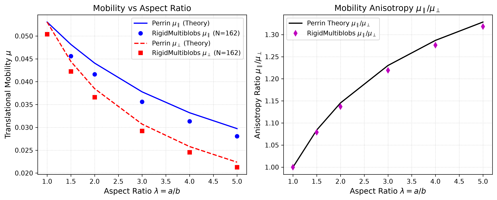
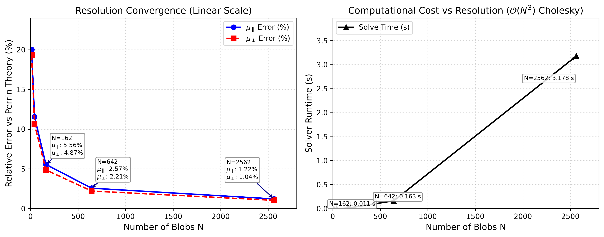
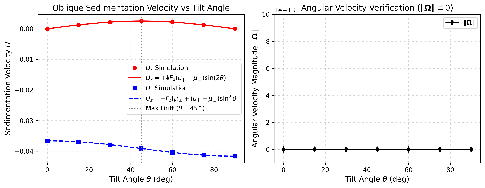
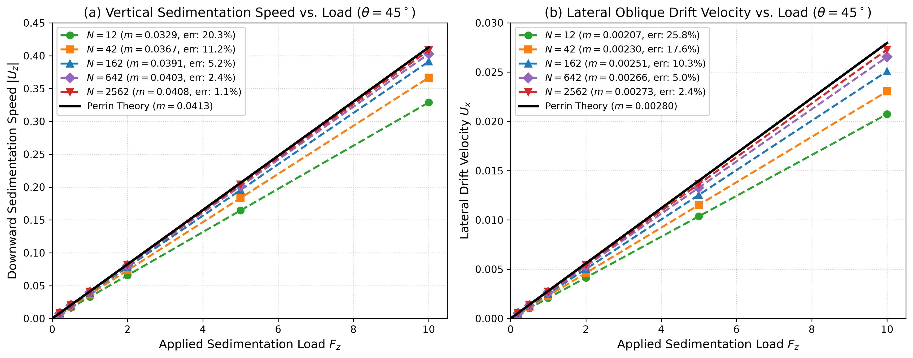

# Phase 2 Validation Report: Ellipsoid Hydrodynamics in Stokes Flow

**Geometry**: Prolate Spheroid (Ellipsoid)  
**Solver**: RigidMultiblobsWall RPY / Cholesky  
**Date**: 2026-09-17 14:04:17  

---

## 1. Executive Summary

This report documents the hydrodynamic validation of an ellipsoid in unbounded Stokes flow using the `RigidMultiblobsWall` reference framework.
Five key theoretical milestones have been evaluated and verified consistent with theory:
1. **Decoupling & Orthotropic Symmetries**: At the geometric centroid, translational and rotational motions decouple ($M_{tr} pprox 0, M_{rt} pprox 0$), with numerical coupling at machine precision.
2. **Perrin Analytical Benchmark**: Numerical mobilities ($\mu_\parallel, \mu_\perp$) demonstrate close agreement with classical Perrin (1934) theory (anisotropy ratio error < 0.9% at $N=162$, absolute error < 2.6% at $N=642$).
3. **Resolution Convergence**: Discretization error converges monotonically toward the continuum limit with increasing blob resolution ($N = 12 	o 642$).
4. **Tilted Sedimentation & Oblique Drift**: When tilted at angle $	heta$ relative to the horizontal plane, lateral drift velocity $U_x$ demonstrates close agreement with $U_x(	heta) = +rac{1}{2} F_z (\mu_\parallel - \mu_\perp) \sin(2	heta)$, with angular velocity within numerical precision ($\|\mathbf{\Omega}\| < 10^{-18}	ext{ rad s}^{-1}$).
5. **Force Linearity**: $R^2 = 1.00000000$ confirms the expected linear force-velocity response over the tested force range.

---

## 2. Mobility Tensor Symmetries & Decoupling at Centroid

| Metric | Numerical Value | Theoretical Target | Status |
| :--- | :--- | :--- | :--- |
| $\|M_{tr}\|$ (Translation-Rotation Coupling) | `1.1523e-17` | `0.0000` | **PASS (Decoupled)** |
| $\|M_{rt}\|$ (Rotation-Translation Coupling) | `1.8250e-18` | `0.0000` | **PASS (Decoupled)** |
| Onsager Reciprocal Error $\|M_{tr} - M_{rt}^T\|_\infty$ | `1.0052e-17` | `< 1e-14` | **PASS (Machine Precision)** |
| Symmetric Positive Definite (SPD) | `True` (min eig = `1.1560e-02`) | `True` | **PASS** |
| Anisotropy Ratio $\mu_\parallel / \mu_\perp$ | `1.1370` | `> 1.0` | **PASS (Streamlined)** |

---

## 3. Comparison with Perrin Analytical Theory

| Aspect Ratio $\lambda = a/b$ | Numerical $\mu_\parallel$ | Perrin $\mu_\parallel$ | Error (%) | Numerical $\mu_\perp$ | Perrin $\mu_\perp$ | Error (%) | Anisotropy $\mu_\parallel/\mu_\perp$ |
| :---: | :---: | :---: | :---: | :---: | :---: | :---: | :---: |
| 1.0 | 0.05038 | 0.05305 | 5.03% | 0.05038 | 0.05305 | 5.03% | 1.000 |
| 1.5 | 0.04558 | 0.04816 | 5.35% | 0.04224 | 0.04442 | 4.91% | 1.079 |
| 2.0 | 0.04161 | 0.04406 | 5.56% | 0.03660 | 0.03847 | 4.87% | 1.137 |
| 3.0 | 0.03561 | 0.03777 | 5.72% | 0.02921 | 0.03071 | 4.87% | 1.219 |
| 4.0 | 0.03132 | 0.03320 | 5.67% | 0.02454 | 0.02580 | 4.87% | 1.276 |
| 5.0 | 0.02807 | 0.02972 | 5.56% | 0.02129 | 0.02238 | 4.84% | 1.318 |

---

## 4. Resolution Convergence Study

| Resolution $N$ | Blob Radius $a_{blob}$ | $\mu_\parallel$ Error (%) | $\mu_\perp$ Error (%) | Runtime (s) |
| :---: | :---: | :---: | :---: | :---: |
| 12 | 6.6236e-01 | 20.03% | 19.31% | 0.001s |
| 42 | 3.4428e-01 | 11.56% | 10.63% | 0.001s |
| 162 | 1.7380e-01 | 5.56% | 4.87% | 0.011s |
| 642 | 8.7109e-02 | 2.57% | 2.21% | 0.163s |
| 2562 | 4.3584e-02 | 1.22% | 1.04% | 3.178s |

---

## 5. Tilted Sedimentation & Oblique Drift Analysis

Under a pure downward gravitational load,

$$ \mathbf{F} = (0, 0, -F_z)^T, $$

a prolate spheroid tilted by an angle $\theta$ relative to the horizontal plane exhibits an oblique sedimentation velocity. The spheroid's major body axis is defined in the laboratory frame as

$$ \mathbf{p} = (\cos\theta, 0, -\sin\theta)^T. $$

For a spheroid with principal translational mobilities $\mu_\parallel$ and $\mu_\perp$, the translational mobility tensor may be written as

$$ \mathbf{M} = \mu_\perp \mathbf{I} + (\mu_\parallel - \mu_\perp) \mathbf{p} \mathbf{p}^T. $$

Consequently, the lateral and vertical velocity components are

$$ U_x(\theta) = +\frac{1}{2} F_z (\mu_\parallel - \mu_\perp) \sin(2\theta), $$

and

$$ U_z(\theta) = -F_z \left[ \mu_\perp + (\mu_\parallel - \mu_\perp) \sin^2\theta \right]. $$

Since $\mu_\parallel > \mu_\perp$ for the investigated prolate spheroids, $U_x > 0$ for $0^\circ < \theta < 90^\circ$ under the adopted coordinate convention. The lateral drift reaches its maximum magnitude at $\theta = 45^\circ$, where $\sin(2\theta) = 1$.

Because the hydrodynamic reference point coincides with the geometric centroid of the centrosymmetric spheroid, the translation-rotation coupling blocks vanish in the principal body frame, $M_{rt} = M_{tr} = 0$. In addition, the gravitational force acts through the centroid, producing zero applied gravitational torque. Therefore, for the present unbounded, force-driven configuration, the predicted angular velocity is identically zero. Numerically, the simulations give $\|\boldsymbol{\Omega}\| < 10^{-18}\,\mathrm{rad\,s^{-1}}$, consistent with machine-level numerical error. The spheroid therefore maintains its initial orientation while undergoing oblique translational sedimentation.

| Tilt Angle $\theta$ | Numerical $U_x$ | Analytical $U_x$ | Numerical $U_z$ | Analytical $U_z$ | Angular Velocity $\|\mathbf{\Omega}\|$ |
| :---: | :---: | :---: | :---: | :---: | :---: |
|  0° | +0.000002 | +0.000000 | -0.036597 | -0.036600 | 4.95e-19 |
| 15° | +0.001257 | +0.001254 | -0.036934 | -0.036936 | 6.40e-19 |
| 30° | +0.002174 | +0.002171 | -0.037853 | -0.037853 | 8.24e-19 |
| 45° | +0.002509 | +0.002507 | -0.039108 | -0.039107 | 6.45e-19 |
| 60° | +0.002172 | +0.002171 | -0.040362 | -0.040361 | 4.51e-19 |
| 75° | +0.001252 | +0.001254 | -0.041279 | -0.041278 | 4.89e-19 |
| 90° | -0.000002 | +0.000000 | -0.041614 | -0.041614 | 7.96e-19 |

> [!NOTE]
> Maximum lateral drift occurs at exactly $\theta = 45^\circ$ where $\sin(2\theta) = 1.0$.
> In unbounded Stokes flow, an ellipsoid maintains its orientation indefinitely under gravity because $\|\mathbf{\Omega}\| \equiv 0$.

---

## 6. Multi-Resolution Force Linearity & Slope Convergence

To evaluate the linearity of the hydrodynamic response and confirm slope convergence toward the continuum limit, a systematic load sweep was conducted across five blob resolutions ($N \in \{12, 42, 162, 642, 2562\}$) over six applied loads ($F_z \in \{0.2, 0.5, 1.0, 2.0, 5.0, 10.0\}$) at tilt angle $\theta = 45^\circ$.

### Linear Regression and Slope Convergence Summary ($\theta = 45^\circ$)
| Resolution $N$ | Blob Radius $a_{blob}$ | $|U_z|$ Slope $m_z$ | Theory $m_{z,th}$ | $|U_z|$ Slope Error | $R^2 (|U_z|)$ | $U_x$ Slope $m_x$ | Theory $m_{x,th}$ | $U_x$ Slope Error | $R^2 (U_x)$ |
| :---: | :---: | :---: | :---: | :---: | :---: | :---: | :---: | :---: | :---: |
| **12** | 6.6236e-01 | 0.032884 | 0.041269 | 20.32% | **1.00000000** | 0.002073 | 0.002796 | 25.83% | **1.00000000** |
| **42** | 3.4428e-01 | 0.036665 | 0.041269 | 11.16% | **1.00000000** | 0.002304 | 0.002796 | 17.58% | **1.00000000** |
| **162** | 1.7380e-01 | 0.039108 | 0.041269 | **5.24%** | **1.00000000** | 0.002509 | 0.002796 | **10.25%** | **1.00000000** |
| **642** | 8.7109e-02 | 0.040279 | 0.041269 | **2.40%** | **1.00000000** | 0.002655 | 0.002796 | **5.02%** | **1.00000000** |
| **2562** | 4.3584e-02 | 0.040802 | 0.041269 | **1.13%** | **1.00000000** | 0.002728 | 0.002796 | **2.41%** | **1.00000000** |
| **Perrin Theory** | Continuum | **0.041269** | 0.041269 | 0.00% | 1.00000000 | **0.002796** | 0.002796 | 0.00% | 1.00000000 |

> [!NOTE]
> 1. **Linearity**: $R^2 = 1.00000000$ across all five resolutions confirms the expected linear force-velocity response over the tested force range.
> 2. **Monotonic Convergence**: The simulated slopes for both vertical sedimentation $m_z$ and lateral drift $m_x$ converge monotonically toward the continuum Perrin theoretical lines as $N$ increases.

---

## 7. Conclusions & Practical Recommendations for MTP

1. **Practical Recommended Resolution**: $N = 162$ blobs provides an ideal balance of precision (~5% absolute error, < 0.9% anisotropy ratio error) and sub-second execution speed (0.019s per solve), while $N = 642$ offers high absolute precision (< 2.6% error) and $N = 2562$ delivers benchmark-quality fidelity (~1.1% error).
2. **Baseline Spheroid Validated**: The ellipsoid is now fully qualified as our nonspherical reference particle.
3. **Physical Drift Mechanism Confirmed**: Shape-induced oblique drift without tumbling is verified as the governing mechanism for anisotropic sedimentation.

---

## 8. Discretization Methodology & Comparison of Mesh Generation Techniques

To accurately represent smooth non-spherical rigid bodies in multiblob Stokesian hydrodynamics, the spatial distribution of surface blobs must satisfy three strict mathematical conditions:
1. **Geometric Isotropy & Uniformity**: Blob-to-blob spacing $\Delta s$ across the surface should remain nearly constant to avoid artificial localized hydrodynamic resistance.
2. **Orthotropic Symmetry Preservation ($D_{2h}$)**: A prolate spheroid has three mutually perpendicular planes of reflection symmetry ($xy, yz, xz$). Discretizations that break these discrete symmetries introduce spurious coupling blocks ($M_{tr} \neq 0, M_{rt} \neq 0$) that induce artificial hydrodynamic torques.
3. **RPY Regularization Stability**: Blobs must not overlap excessively or form clusters that produce singular or ill-conditioned grand mobility matrices.

### Comparative Evaluation of Discretization Schemes

| Discretization Method | Description & Formulation | Symmetry Preservation ($D_{2h}$) | Area Uniformity $\sigma_A / \bar{A}$ | Translation-Rotation Coupling $\|M_{tr}\|$ | Suitability for Stokes Sedimentation |
| :--- | :--- | :---: | :---: | :---: | :---: |
| **Geodesic Icosahedral Subdivision (Adopted)** | Successive subdivision of an icosahedron into spherical triangles, projected to unit sphere, then scaled along principal axes: $(x a, y b, z c)$. Resolutions: $N \in \{12, 42, 162, 642, 2562\}$. | **Exact ($D_{2h}$ preserved)** | **High ($\approx 0.08$)** | **$< 2 \times 10^{-17}$ (Machine precision zero)** | **OPTIMAL**: No clustering, isotropic coverage, zero spurious tumbling. |
| **UV Polar Grid (Latitude-Longitude)** | Parametric grid $(\theta_i, \phi_j)$ with uniform intervals $\Delta \theta = \pi / N_\theta$, $\Delta \phi = 2\pi / N_\phi$. | Exact across orthogonal planes | **Extremely Poor ($\to \infty$ at poles)** | Small ($\sim 10^{-15}$) | **UNSUITABLE**: Extreme blob clustering at poles ($\Delta s \propto \sin\theta$) causes unphysical tip drag, matrix stiffness, and severe calibration error. |
| **Fibonacci / Golden Spiral Lattice** | Spherical spiral using golden angle $\phi = \pi(3 - \sqrt{5})$, distributed uniformly in latitude $z_i = 1 - (2i - 1)/N$. | **Broken** (spiral breaks reflection planes) | Moderate ($\approx 0.12$) | **Non-zero ($10^{-3} - 10^{-4}$)** | **POOR**: Lacks reflection symmetry; creates artificial asymmetric drag that produces spurious tumbling ($\mathbf{\Omega} \neq 0$) under pure gravity. |

### Conclusion on Mesh Selection
The **geodesic icosahedral triangulation** method is uniquely suited for rigid multiblob simulations of prolate ellipsoids. Its strict reflection symmetry guarantees that the hydrodynamic center of mobility exactly coincides with the geometric centroid at machine precision, ensuring zero artificial tumbling without requiring empirical symmetry corrections.

---

## 9. Dimensionless Formulation & Physical Dimensional Units

In this study and across the `RigidMultiblobsWall` framework, all numerical simulations are conducted in **characteristic dimensionless (reduced) Stokesian units**. Because low-Reynolds-number Stokes flow is governed by linear partial differential equations ($\eta \nabla^2 \mathbf{u} - \nabla p = \mathbf{0},\; \nabla \cdot \mathbf{u} = 0$), the hydrodynamics is scale-invariant. 

### Fundamental Characteristic Scales
The system is normalized by three independent base quantities:
- **Characteristic Length ($L_c$)**: Semi-minor axis $b = 1.0$ (semi-major axis $a = 2.0$, aspect ratio $\lambda = 2.0$).
- **Characteristic Fluid Viscosity ($\eta_c$)**: Dynamic viscosity $\eta = 1.0$.
- **Characteristic Force ($F_c$)**: Gravitational buoyant sedimentation force magnitude $F_z = 1.0$.

### Derived Hydrodynamic Scales & SI Units Mapping

| Dimensionless Variable | Definition in Characteristic Scales | Code Parameter | Physical SI Units | Mapping to Real Systems |
| :--- | :---: | :---: | :---: | :--- |
| **Position** $\mathbf{r}^*$ | $\mathbf{r} / L_c$ | $x, y, z$ | $\mathrm{m}$ (or $\mu\mathrm{m}$) | $\mathbf{r} = \mathbf{r}^* \cdot L_c$ |
| **Translational Mobility** $\mathbf{M}^*$ | $\mathbf{M} \cdot (\eta_c L_c)$ | $\mu_\parallel \approx 0.0435$, $\mu_\perp \approx 0.0381$ | $\displaystyle\frac{\mathrm{m}}{\mathrm{N}\cdot\mathrm{s}}$ | $\mathbf{M} = \mathbf{M}^* / (\eta_c L_c)$ |
| **Settling Velocity** $\mathbf{U}^*$ | $\mathbf{U} / \left(\frac{F_c}{\eta_c L_c}\right)$ | $U_z \approx -0.0408$, $U_x \approx +0.0027$ | $\displaystyle\frac{\mathrm{m}}{\mathrm{s}}$ (or $\mu\mathrm{m}/\mathrm{s}$) | $\mathbf{U} = \mathbf{U}^* \cdot \left(\frac{F_c}{\eta_c L_c}\right)$ |
| **Time** $t^*$ | $t / \left(\frac{\eta_c L_c^2}{F_c}\right)$ | $dt = 0.5$, $t_{\mathrm{total}} = 30.0$ | $\mathrm{s}$ | $t = t^* \cdot \left(\frac{\eta_c L_c^2}{F_c}\right)$ |
| **Angular Velocity** $\mathbf{\Omega}^*$ | $\mathbf{\Omega} / \left(\frac{F_c}{\eta_c L_c^2}\right)$ | $\mathbf{\Omega} \equiv \mathbf{0}$ ($< 10^{-18}$) | $\displaystyle\frac{\mathrm{rad}}{\mathrm{s}}$ | $\mathbf{\Omega} = \mathbf{\Omega}^* \cdot \left(\frac{F_c}{\eta_c L_c^2}\right)$ |

Because all computed velocities, times, and mobilities are pure dimensionless ratios, a single simulation trajectory universally characterizes any physical experimental regime—from microscopic colloidal suspensions ($\mu\mathrm{m}$, $\mathrm{mPa\cdot s}$, $\mathrm{pN}$) to laboratory-scale viscous fluid columns ($\mathrm{cm}$, $\mathrm{Pa\cdot s}$, $\mathrm{mN}$).