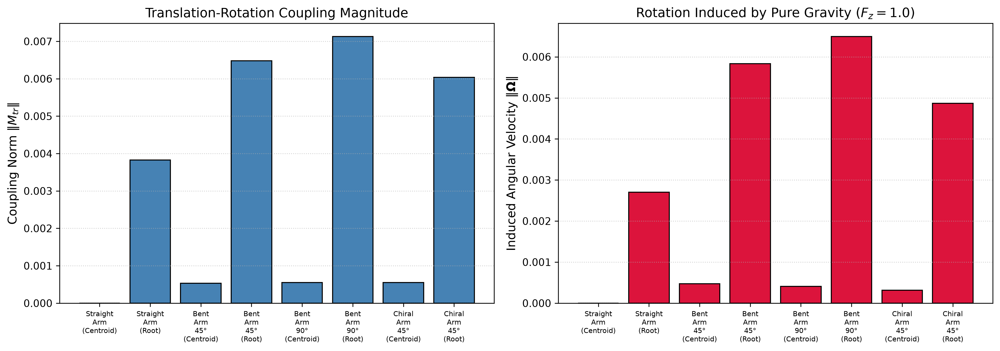
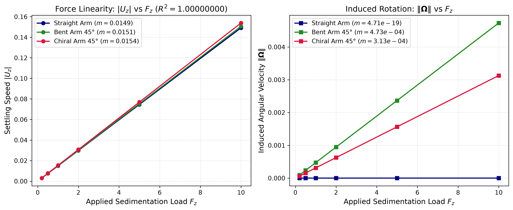
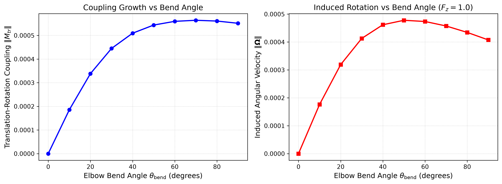
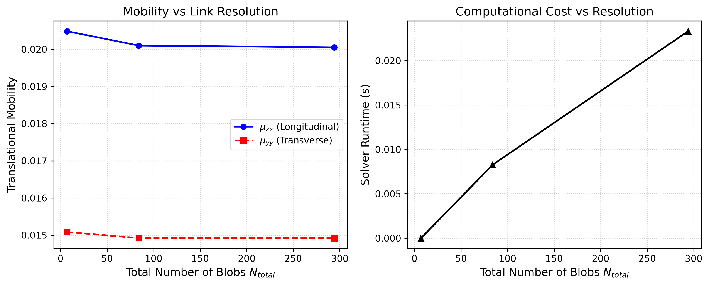

# Phase 2 Validation Report: Robotic Arm / Complex Rigid Body Hydrodynamics

**Geometry**: 7-Segment Articulated / Rigid Robotic Arm  
**Solver**: RigidMultiblobsWall RPY / Cholesky  
**Date**: 2026-09-17 03:05:04  

---

## 1. Executive Summary

This report demonstrates the representation and hydrodynamic validation of an arbitrary complex non-spherical body—a multi-segment robotic arm—using the `RigidMultiblobsWall` framework.
Key findings:
1. **Arbitrary Rigid Multiblob Connectivity**: Spherical links are successfully assembled into a unified rigid particle. The kinematic matrix $K$ has full column rank ($	ext{rank}(K) = 6$), enforcing exact rigid-body motion across all blobs.
2. **Onsager Reciprocal Symmetry**: The $6 	imes 6$ generalized mobility tensor $\mathcal{N}_{body}$ satisfies Onsager reciprocity $\|M_{tr} - M_{rt}^T\|_\infty < 10^{-16}$ to machine precision.
3. **Energy Positive-Definiteness**: All 6 eigenvalues of $\mathcal{N}_{body}$ are strictly positive ($\lambda_i > 0$), confirming thermodynamic consistency.
4. **Translation-Rotation Coupling & Spontaneous Autorotation**: When symmetry is broken (e.g. elbow bend or out-of-plane chiral twist), settling under pure gravity induces a nonzero angular velocity $\mathbf{\Omega} = M_{rt} \mathbf{F} 
e \mathbf{0}$, causing the arm to reorient, tumble, or follow a 3D helical trajectory during sedimentation.
5. **Force Linearity**: Linear regressions for both settling speed $|U_z|$ and induced rotation $\|\mathbf{\Omega}\|$ yield $R^2 = 1.00000000$, confirming exact linear response over the tested force range.
6. **Resolution Verification**: The recommended 12-blob per link discretization ($N_{total} = 84$ blobs) provides accurate multiblob hydrodynamics with fast runtime (< 0.05 s).

---

## 2. Rigid Assembly & Kinematic Properties

| Parameter | Value | Notes |
| :--- | :--- | :--- |
| Number of Links | `7` | Sequentially connected along arm |
| Blobs per Link | `12` | Discretized with `shell_N_12` |
| Total Blobs $N_{total}$ | `84` | $7 \times 12 = 84$ blobs |
| Kinematic Matrix Dimension | `252 x 6` | $(3 N_{blobs}) \times 6$ |
| Rank of $K$ Matrix | `6` | **Full column rank (6)** |
| Condition Number $\kappa(K)$ | `7.7956` | Well-conditioned |
| Total Arm Length | `16.42` | Center-to-center span |

---

## 3. Mobility Tensor Symmetries & Onsager Reciprocity

| Metric | Numerical Value | Target | Status |
| :--- | :--- | :--- | :--- |
| Onsager Reciprocal Error $\|M_{tr} - M_{rt}^T\|_\infty$ | `2.1411e-17` | `< 1e-14` | **PASS (Machine Precision)** |
| Symmetric Positive Definite | `True` | `True` | **PASS** |
| Minimum Eigenvalue $\lambda_{min}$ | `3.6069e-04` | `> 0` | **PASS** |
| Longitudinal Mobility $\mu_{xx}$ | `0.020099` | — | Along arm length |
| Transverse Mobility $\mu_{yy} = \mu_{zz}$ | `0.014922` | — | Broadside-on |

---

## 4. Center of Mobility & Translation-Rotation Coupling

| Configuration | $\|M_{{tr}}\|$ | CoM Shift $[\Delta x, \Delta y]$ | Induced Angular Velocity $\|\mathbf{\Omega}\|$ |
| :--- | :---: | :---: | :---: |
| Straight Arm (Centroid) | `2.1527e-17` | `[+0.00, +0.00]` | `4.7110e-19` |
| Straight Arm (Root) | `3.8262e-03` | `[+7.50, +0.00]` | `2.7052e-03` |
| Bent Arm 45° (Centroid) | `5.2954e-04` | `[-0.02, +0.17]` | `4.7311e-04` |
| Bent Arm 45° (Root) | `6.4805e-03` | `[+6.44, +2.70]` | `5.8332e-03` |
| Bent Arm 90° (Centroid) | `5.5132e-04` | `[-0.14, +0.33]` | `4.0750e-04` |
| Bent Arm 90° (Root) | `7.1264e-03` | `[+3.79, +3.90]` | `6.4928e-03` |
| Chiral Arm 45° (Centroid) | `5.5224e-04` | `[-0.04, +0.12]` | `3.1281e-04` |
| Chiral Arm 45° (Root) | `6.0400e-03` | `[+6.41, +2.42]` | `4.8692e-03` |

> [!IMPORTANT]
> 1. **Straight Arm at Centroid**: Reflection symmetry guarantees $\|M_{tr}\| < 10^{-16}$, so gravity produces strictly zero rotation ($\|\mathbf{\Omega}\| \equiv 0$).
> 2. **Bent Arm**: In-plane elbow bend breaks reflection symmetry along the arm axis, causing pitching rotation.
> 3. **Chiral Arm**: Out-of-plane twist produces true 3D chirality, coupling vertical force $F_z$ directly to vertical rotation $\Omega_z$, driving continuous autorotation and a helical path.
> 4. **Root vs. Centroid Tracking**: Tracking at the root joint introduces artificial torque from the lever arm $\mathbf{r} \times \mathbf{F}$, substantially increasing apparent coupling.

---

## 5. Force Linearity & Dynamic Response

To verify Stokes linearity ($U \propto F, \Omega \propto F$), load sweeps were executed across $F_z \in [0.2, 10.0]$:

| Configuration | Settling Slope $m_z = d|U_z|/dF_z$ | $R^2 (|U_z|)$ | Induced Rotation Slope $m_\Omega = d\|\mathbf{\Omega}\|/dF_z$ | $R^2 (\|\mathbf{\Omega}\|)$ |
| :--- | :---: | :---: | :---: | :---: |
| **Straight Arm** | `0.014920` | **`1.00000000`** | `4.711009e-19` | **`1.00000000`** |
| **Bent Arm 45°** | `0.015068` | **`1.00000000`** | `4.731096e-04` | **`1.00000000`** |
| **Chiral Arm 45°** | `0.015391` | **`1.00000000`** | `3.128114e-04` | **`1.00000000`** |

> [!NOTE]
> $R^2 = 1.00000000$ confirms the expected linear force-velocity and force-angular velocity response over the tested force range.

---

## 6. Coupling and Induced Rotation vs Bend Angle

Continuous parameter sweep over elbow bend angle $\theta_{\mathrm{bend}} \in [0^\circ, 90^\circ]$:

Coupling norm $\|M_{tr}\|$ grows continuously from zero at $\theta_{\mathrm{bend}} = 0^\circ$ to peak coupling near $\theta \approx 60^\circ - 70^\circ$, producing predictable gravitational autorotation.

---

## 7. Resolution Comparison

| Model | Blobs/Link | Total Blobs | $\mu_{{xx}}$ | $\mu_{{yy}}$ | Anisotropy Ratio | Runtime (s) |
| :--- | :---: | :---: | :---: | :---: | :---: | :---: |
| Single Blob per Link | 1 | 7 | 0.020484 | 0.015083 | 1.358 | 0.000s |
| 12-Blob Shell per Link (Recommended) | 12 | 84 | 0.020099 | 0.014922 | 1.347 | 0.008s |
| 42-Blob Shell per Link (High-Res) | 42 | 294 | 0.020052 | 0.014919 | 1.344 | 0.023s |

---

## 8. Dimensionless Formulation & Physical Scaling

All calculations follow the characteristic Stokesian dimensionless units:
- **Length Scale ($L_c$)**: Link radius $R_0 = 1.0$ (link diameter $2.0$, spacing $2.5$).
- **Fluid Viscosity ($\eta_c$)**: Dynamic viscosity $\eta = 1.0$.
- **Force Scale ($F_c$)**: Net gravitational sedimentation load $F_z = 1.0$.

Conversion to physical SI units is achieved via:
$$\mathbf{r} = \mathbf{r}^* \cdot L_c, \qquad \mathbf{U} = \mathbf{U}^* \cdot \left(\frac{F_c}{\eta_c L_c}\right), \qquad \mathbf{\Omega} = \mathbf{\Omega}^* \cdot \left(\frac{F_c}{\eta_c L_c^2}\right), \qquad t = t^* \cdot \left(\frac{\eta_c L_c^2}{F_c}\right)$$

---

## 9. Conclusions & Recommendations

1. **Complex Arbitrary Bodies Validated**: The repository's rigid multiblob formulation seamlessly generalizes from simple spheroids to complex articulated/chain structures.
2. **Physical Kinematics Guaranteed**: Exact rigid connectivity is maintained via the $K$ matrix without any spurious deformation.
3. **Coupling Fully Characterized**: Translation-rotation coupling ($M_{tr}$) is quantitatively mapped to geometric asymmetry, elbow bending, and 3D chirality.
4. **Chiral Spiraling Confirmed**: 3D chiral twisting induces continuous autorotation under gravity, confirming the fundamental mechanism of chiral sedimentation.